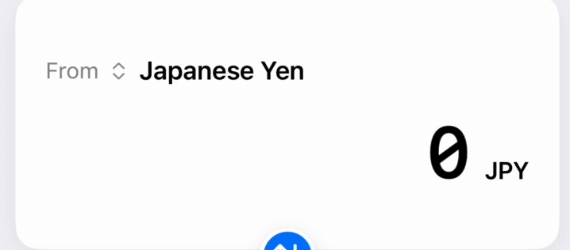
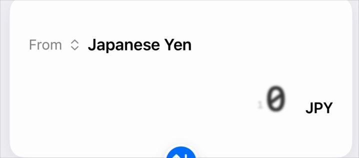
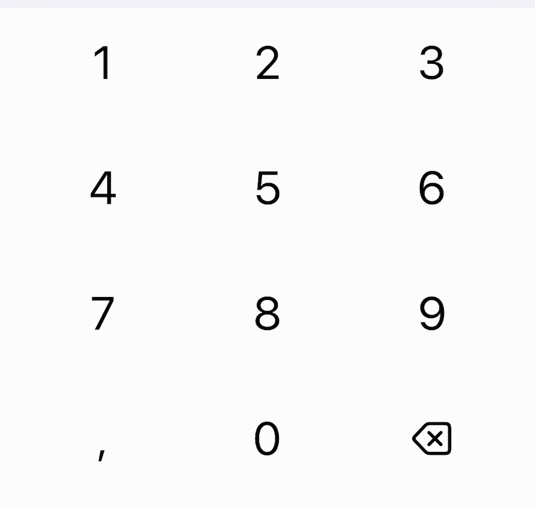

### App Development Log

#### Day 1: Laying the Groundwork

The first day was all about understanding the landscape and setting a solid foundation. I started by exploring popular currency converter apps, analyzing their user interfaces, and identifying features that resonated with users. This helped me refine my vision for the app and prioritize key functionalities.

Next, I delved into the API documentation for ExchangeRatesAPI and Open Exchange Rate. Testing their endpoints gave me insights into their response structures and limitations. One key realization was the restricted number of free API calls, which led me to decide on implementing a caching mechanism. After some deliberation, I concluded that caching exchange rates for 12 to 24 hours would strike a good balance between data freshness and efficiency.

#### Day 2: Setting Up the Project

On this day, I was busy, so I just set up the project. I initialized the project in Xcode and designed a basic app interface using mock data. I also created an app icon using [icon.kitchen](https://icon.kitchen) to generate a professional-looking icon quickly.

#### Day 3: A Brief Pause

No work was done on this day due to other commitments.

#### Day 4: Core Development Begins

With a clear vision, I dived into implementing the core functionality on day four. The first major task was creating the `NetworkManager` class, which acts as the backbone for API interactions. To ensure robustness, I incorporated error handling using a custom `NetworkError` enum. This decision was driven by the need to handle various network scenarios gracefully.

While working on caching the exchange rate, I designed the `StorageService` class to manage data storage using `UserDefaults`. I also prioritized user-centric design by enabling the app by saving last chosen currency by user using the `StorageService` class I've just written.

The `CurrencyConverterViewModel` was the next focus. This component became the central hub for managing app state. It includes functionality for:
- Loading exchange rates from cache or fetching them from an API.
- Saving and retrieving user preferences for selected currencies.
- Calculating conversions dynamically.
- Allowing users to swap the "from" and "to" currencies with ease.

I started with implementing a basic UI layout that included essential elements: an amount display field, a converted amount display, and two currency selection buttons that open the currency picker. This formed the foundation of the user interface, allowing basic currency conversion functionality.

Implementing the currency picker presented an interesting challenge. Initially, I used a simple `Picker` view that displayed only currency codes. However, I soon realized that with the large number of available currencies, users would have to scroll through an impractically long list. To address this, I decided to implement a full-screen view and use a `Sheet` to display it. This approach allowed me to create a more sophisticated picker interface that displays both currency codes and names. I also added a search bar to help users quickly find specific currencies. One technical challenge arose when the picker sheet always opened scrolled to the top, regardless of the currently selected currency. I solved this by implementing `ScrollViewReader` and `ScrollViewProxy` to automatically scroll to the selected currency when the sheet opens.

After completing the currency picker, I realized the app's interface was quite simple - just input fields and buttons. To enhance the user experience, I decided to implement a custom animated numeric keypad instead of using the standard iOS keyboard. This addition would give the app a more polished, calculator-like feel. I definitely took inspiration from the calculator app on iOS.

This is how my app looked at the end of day 4:

#### Day 5: Enhancing User Experience and Error Handling

On the fifth day, my focus shifted to interactivity and aesthetics. To make the app feel responsive, I added animations to the keypad. A subtle scaling effect on key taps and haptic feedback turned mundane interactions into delightful ones.

Creating a custom `AnimatedDigitView` was a rewarding challenge. By combining blur transitions, scaling, and offset animations, I transformed digit updates into visually engaging moments. These small touches significantly enhanced the app's appeal.

This is how the animation displayed

To enhance the custom keypad, I added subtle animations with scaling effects and haptic feedback, making the interaction feel more responsive and tactile.

I also implement some error handling and network state management. The app now gracefully handles various network states, such as online, offline with valid cache, offline with expired cache, and error states. Each state is visually distinct, providing users with clear feedback on the app's status.

**Network States**
- **Online**: Normal operation with live API data
- **Offline with Valid Cache**: Falls back to cached rates, shows offline banner
- **Offline with Expired Cache**: Uses cached data with warning banner, prompts update
- **Error State**: Shows error message with retry option

#### Day 6: Refinement and Final Touches

With the core features in place, I shifted gears to polish the app. Documentation became a priority, as I wanted the codebase to be as accessible as possible. Every key component, from `NetworkManager` to `StorageService`, was meticulously documented to ensure clarity.

Testing was another crucial focus. I leveraged the new [Swift Testing](https://developer.apple.com/documentation/testing/) framework, which provides a more declarative and modular approach to testing with its `@Suite` and `@Test` attributes. I wrote comprehensive unit tests across three main areas:

1. **Exchange Rate Tests**
   - Validated correct JSON decoding from API responses
   - Tested handling of invalid currency codes with fallback behavior 
   - Verified empty rates dictionary handling
   - Ensured proper conversion of API data to model objects

2. **Storage Manager Tests**
   - Verified exchange rate caching functionality
   - Tested persistence of user currency preferences
   - Validated cache invalidation behavior
   - Confirmed data integrity across app restarts

3. **Currency Converter ViewModel Tests**
   - Tested currency conversion accuracy with mock rates
   - Verified currency swap functionality
   - Validated amount formatting for various inputs
   - Tested network state transitions and offline behavior
   - Confirmed proper cache fallback during offline mode

Each test suite includes setup and teardown procedures to ensure test isolation. I used async/await for asynchronous operations and implemented proper error handling. The Swift Testing framework's structured approach helped organize the tests logically and made async testing more straightforward. The tests helped catch edge cases, like handling invalid currencies and network state transitions, making the app more robust.

Towards the end of the day, I realized the app supported only one API service (Open Exchange Rate). To address this limitation, I added support for ExchangeRatesAPI, giving users and evaluators the flexibility to choose their preferred service. Implementing a seamless switching mechanism involved designing a configurable endpoint system, which further enhanced the app's versatility.

#### Reflection

That's all on how I built this app. At first I was thinking it was a simple app but as I started building it, I realized there were many aspects to consider. From API integration to caching, error handling, and user experience, each component played a crucial role in shaping the final product. I learned a lot about SwiftUI, and the Swift Testing framework during this project. There're a lot of improvements that can be made to this app, but the time constraint limited the scope of the project. I hope you enjoyed reading about my development journey. Feel free to reach out if you have any questions or feedback. Thank you for reading!
