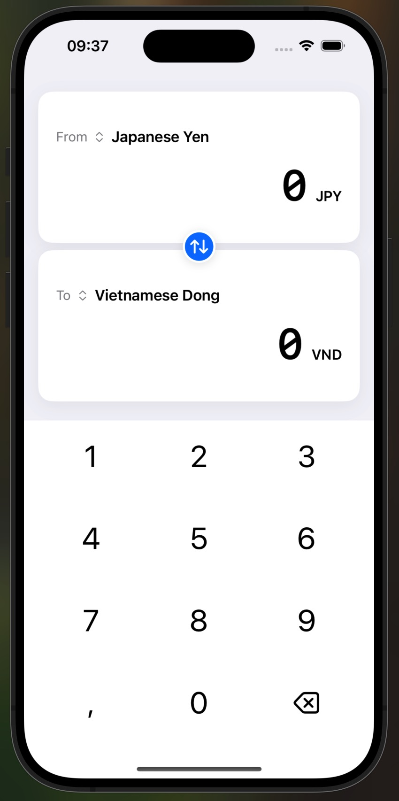
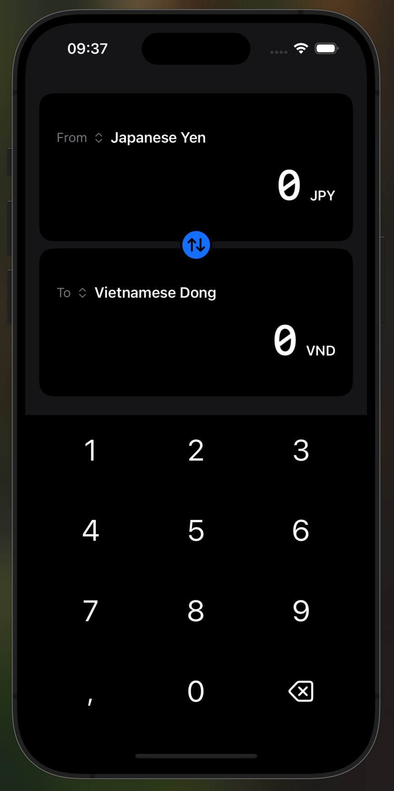
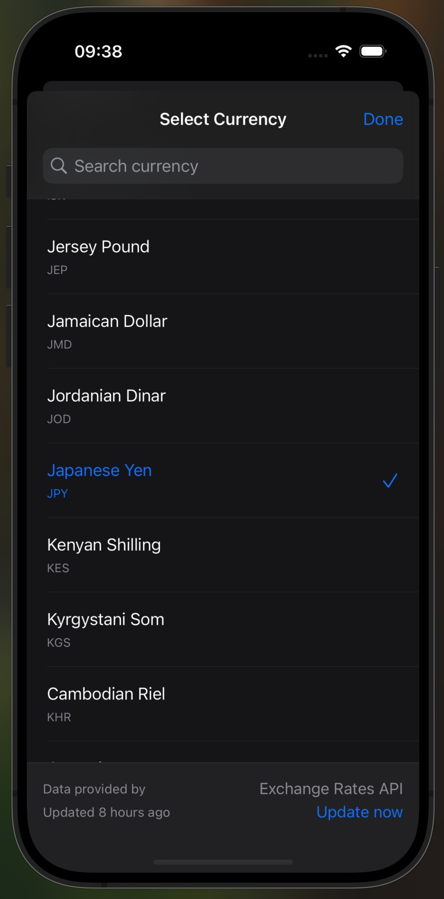

# Currency Converter iOS App

A modern iOS currency converter application built with SwiftUI that supports offline functionality, real-time updates, and animations.
<p align="center">
  
</p>

<p align="center">

</p>

## Screenshots

<p align="center">
  
  
  
</p>

## Features

- Real-time currency conversion
- Offline mode with cached data
- Custom animated numeric keypad
- Search and filter currencies
- Automatic network state handling

## Project Structure

```
CurrencyConverter/
├── App/
│   └── CurrencyConverterApp.swift
├── Models/
│   ├── Currency.swift
│   └── ExchangeRates.swift
├── Views/
│   ├── MainAppView/
│   │   ├── CurrencyConverterView.swift
│   │   ├── CurrencyCard.swift
│   │   └── CustomKeypadView.swift
│   ├── CurrencyPicker/
│   │   ├── CurrencyPickerView.swift
│   │   └── CurrencyListView.swift
├── ViewModels/
│   └── CurrencyConverterViewModel.swift
├── Services/
│   └── CurrencyConverterServices.swift
├── Helpers/
│   ├── NetworkManager.swift
│   ├── NetworkMonitor.swift
│   └── StorageManager.swift
└── Utils/
    ├── Error.swift
    └── Utils.swift
```

## Setup Instructions

### Prerequisites
- Xcode 15.0 or later
- iOS 17.0 or later
- Active internet connection for initial setup

### API Keys Setup

1. Sign up for API keys at:
   - [Open Exchange Rates](https://openexchangerates.org/signup)
   - [Exchange Rates API](https://exchangeratesapi.io/)

> **Note**: You only need to choose one API provider. Set your preferred provider in `NetworkManager.swift` by modifying the `service` variable:
> ```swift
> public let service = ExchangeRatesService.ExchangeRatesAPI // or .OpenExchangeRatesAPI
> ```

2. Create `Configuration.plist` in the project root:
```xml
<?xml version="1.0" encoding="UTF-8"?>
<!DOCTYPE plist PUBLIC "-//Apple//DTD PLIST 1.0//EN" "http://www.apple.com/DTDs/PropertyList-1.0.dtd">
<plist version="1.0">
<dict>
    <key>OpenExchangeRatesAPIKey</key>
    <string>YOUR_OPEN_EXCHANGE_RATES_API_KEY</string>
    <key>ExchangeRatesAPIKey</key>
    <string>YOUR_EXCHANGE_RATES_API_KEY</string>
</dict>
</plist>
```

### Building the Project
1. Clone the repository
2. Open the project in Xcode
3. Select your development team in project settings
4. Setup API keys as described above
5. Build and run using Xcode's play button or <kbd>⌘</kbd> + <kbd>R</kbd>

## Architecture

- **MVVM Pattern**: Separation of concerns between Views, ViewModels, and Models
- **Service Layer**: Handles API communication and data formatting
- **Observer Pattern**: Using Combine for reactive updates

## Error Handling

The app implements comprehensive error handling for:
- Network connectivity issues
- API request failures
- Data parsing errors
- Cache management
- Offline operation

## Additional Notes

### Caching
- Exchange rates are cached for 24 hours
- User preferences (selected currencies) are persisted
- Offline mode automatically uses cached data

### Network States
- Online: Normal operation
- Offline with valid cache: Limited operation
- Offline with expired cache: Warning state
- Error: Recovery options

## Development Log

For detailed insights into the development process, technical decisions, and implementation challenges, check out the [Development Log](development-log.md).